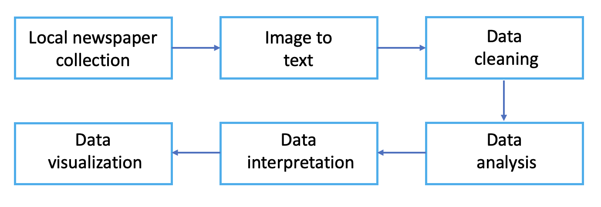
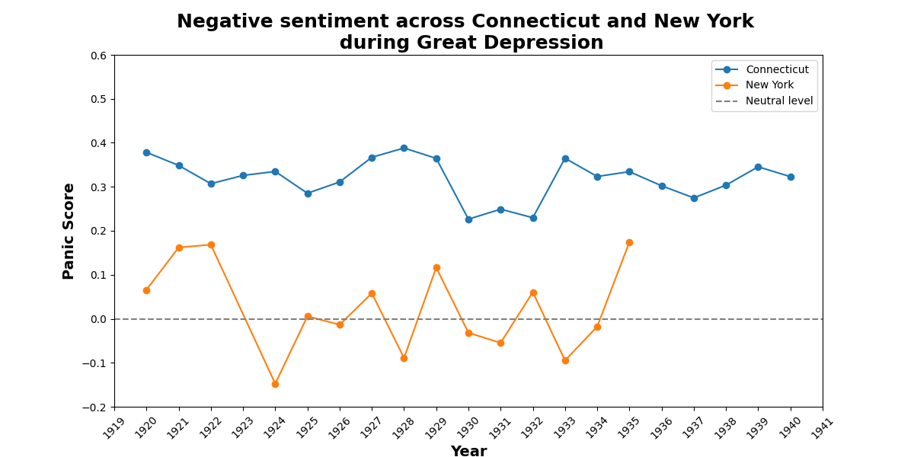
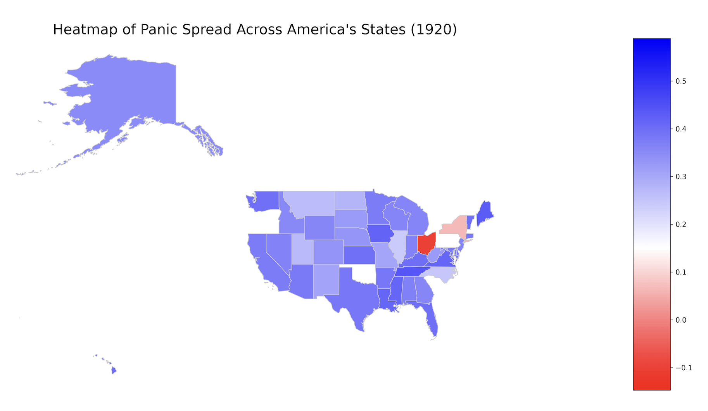

# Regional variation of negative sentiment during Great Depression through newspaper articles using NLP

## Motivation
The causes behind the severity and longevity of the Great Depression have been extensively studied by economists and historians. In comparison to the 2008 Great Financial Crisis, there is limited data availability on the Great Depression, making it challenging to obtain detailed and comprehensive information on the economic conditions of the time. The structured data that I create could provide a more complete picture of the sentiment and topics covered in newspaper articles during that era, and shed light on the economic and social conditions of the time. Understanding the factors that contributed to the Great Depression's severity and duration is crucial to gain a deeper understanding of its impact on people, institutions, and governments.

## Workflow

  

Step1: Searching databases of newspapers from the 1930s. Some relevant databases include:
##TODO make a list
ProQuest Historical Newspapers
Chronicling America
Newspapers.com
Gale Primary Sources
NewspaperArchive.com

In this work, we use Chronicling America, operated by the Library of Congress, primarily as the data source since it is already in text format and allows for data scraping

Step2: Use Optical Character Recognition (OCR) techniques to extract text from the identified regions. This will allow me to convert text in the newspaper articles from images to machine-readable text.

Step3:  Break the OCR into 100-200 word chunks, then drop chunks with <90% (or so) word rate. Perform text pre-processing techniques such as tokenization, stemming, and stop-word removal to prepare the text for analysis. This will clean and normalize the text data for sentiment analysis and topic modeling.

Step4: 

Sentiment Analysis: Use a Convolutional Neural Network (CNN) to extract features from the text, followed by a Recurrent Neural Network (RNN) or Long Short-Term Memory (LSTM) model to perform sentiment analysis and determine the overall sentiment of newspaper articles regarding the Great Depression.

In order to show the negative sentiment more clearly, we define the panic score function:
$Panic \ score = log(sentiment \  socre + 1)$

# Add the single data analysis (New York v.s. Connecticut)

  

# Add the video

  

Unfortunately, GitHub doesn't support embedding videos directly in README files. However, you can find the "heatmap_evolution_597.mp4" in the repo and download it to watch.

## Future steps:
1. Fine tuning off-the-shelf Roberta. Pick out articles about economic news/bankrupcy/small business need loans
